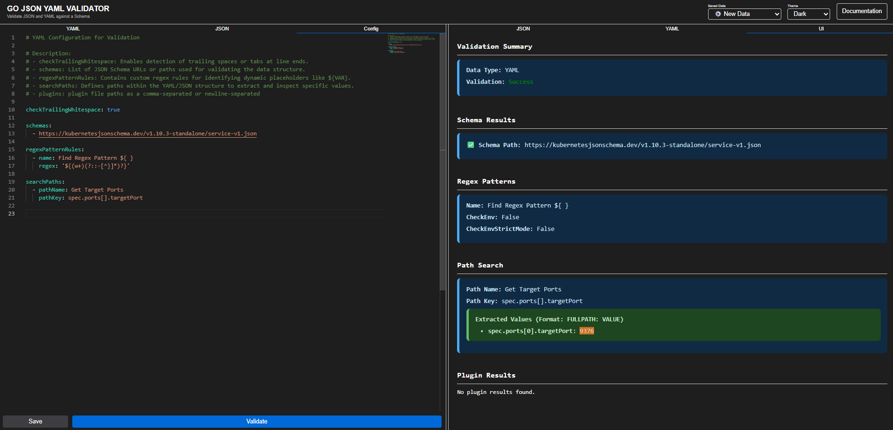
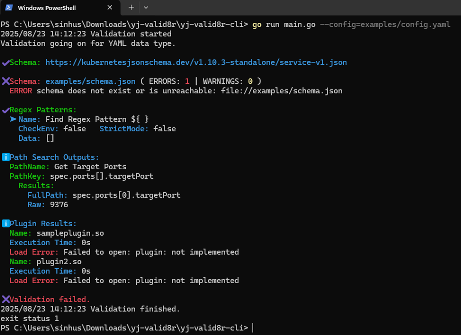

# YJ-Valid8r: Validate JSON & YAML with CLI, Web Playground & Go Library

**A modular toolkit for validating JSON & YAML files using custom rules and JSON Schema checks.**

It provides independent components — a powerful **CLI**, an interactive **Web Playground**, and reusable **Go libraries** — so you can integrate validation into your pipelines, applications, or developer workflows with ease.

Designed for flexibility, it also supports a plugin system to extend validation logic beyond schemas, enabling deep data quality checks tailored to your needs.

[]()
[](LICENSE)


| Web Screenshot | CLI Screenshot |
|----------------|----------------|
|  |  |


## Project Structure

```
yj-valid8r/
├── yj-valid8r-lib/      # Core parsing & validation logic
├── yj-valid8r-cli/      # Command-line tool
│   └── examples/
│       └── config.yaml  # Sample config
├── yj-valid8r-web/      # Web server / API
└── yj-valid8r-common/   # Shared utils used in web and cli
```

## Usage

### Run CLI

```bash
cd yj-valid8r/yj-valid8r-cli
go run main.go --config=examples/config.yaml
```

See the [README](yj-valid8r-cli) in the `yj-valid8r-cli` directory for more details.

### Run Web

```bash
cd yj-valid8r/yj-valid8r-web
go run main.go
```

See the [README](yj-valid8r-web) in the `yj-valid8r-web` directory for more details.

### Use as a Library

```go
import validator "github.com/sassoftware/yj-valid8r/yj-valid8r-lib"

result := validator.CheckTabsAndWhitespacesFinder(dataBytes)
```

See the [README](yj-valid8r-lib) in the `yj-valid8r-lib` directory for more details.

## Plugin Support

You can extend validations using custom Go plugins.

### Enable Plugin Support

Add in your config or pass via flag (`--plugins=examples/plugin1.so,examples/plugin2.so`):

```yaml
plugins: |
  examples/plugin1.so
  examples/plugin2.so
```

### Plugin Example Structure

```go
package main

// SamplePlugin demonstrates a valid plugin structure
type SamplePlugin struct{}

// Name returns the name of the plugin
func (p *SamplePlugin) Name() string {
	return "SamplePlugin"
}

// Run processes the data and returns message, warnings, and errors
func (p *SamplePlugin) Run(data []byte) ([]string, []string, []string) {
	return []string{"Sample message from plugin"}, []string{"Sample warning"}, []string{"Sample error"}
}

// Required exported symbol
var PluginInstance = &SamplePlugin{}
```

### Build Command

```bash
go build -buildmode=plugin -o plugins/sampleplugin.so plugins/sampleplugin/plugin.go
```

### Output Example

```json
{
  "name": "SamplePlugin",
  "messages": ["Message"],
  "warnings": ["Warning"],
  "errors": ["Error"],
  "execution_time": 1234
}
```

## Security
See the [SECURITY.md](SECURITY.md) file for details on our security policy and how to report vulnerabilities.

## Issues

See the [SUPPORT.md](SUPPORT.md) file for information on how to open an issue against this repository.

## Contributing

Contributions are welcome! Please read our [Contributing Guidelines](CONTRIBUTING.md) for more information.

## License

This project is licensed under the Apache 2.0 License. See the [LICENSE](LICENSE) file for details.

## Attributions

This project uses the following open source libraries and components:

- [Go standard library](https://golang.org/LICENSE)
- [gopkg.in/yaml.v3](https://github.com/go-yaml/yaml/blob/v3.0.1/LICENSE)
- [gin-gonic/gin](https://github.com/gin-gonic/gin/blob/master/LICENSE)
- [xeipuuv/gojsonschema](https://github.com/xeipuuv/gojsonschema/blob/master/LICENSE-APACHE-2.0.txt)
- [fatih/color](https://github.com/fatih/color/blob/main/LICENSE.md)
- [js-yaml](https://github.com/nodeca/js-yaml/blob/master/LICENSE)
- [monaco-editor](https://github.com/microsoft/monaco-editor/blob/main/LICENSE.txt)

## Contact

For any inquiries or support, please reach out to:

- [Huzaib Sayyed](mailto:huzaib.sayyed@gmail.com)

